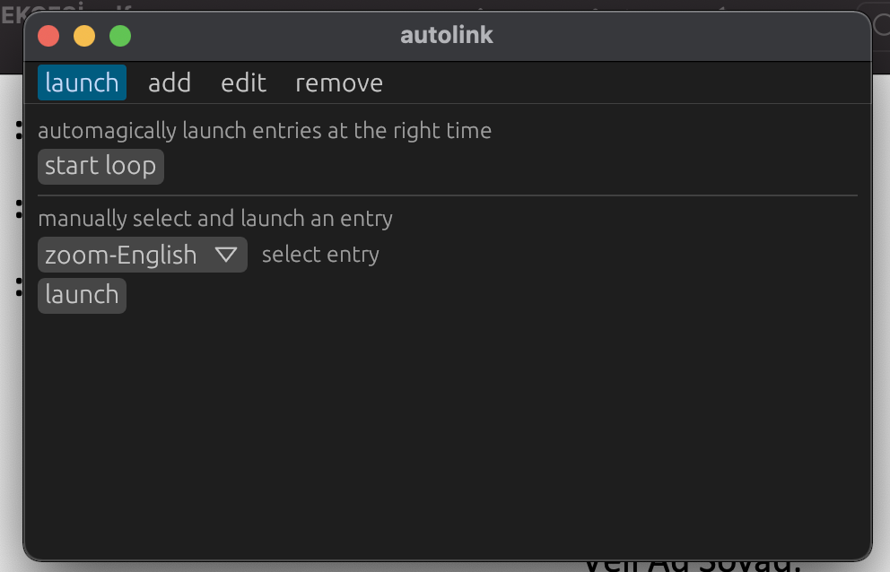

# autolink-egui

A simple app to open links at the right time.

## Installing

autolink is built and packaged via cargo and cargo-bundle respectively.

Clone autolink-lib to the parent directory

```
git clone https://github.com/styrowolf/autolink-lib.git
```

Building autolink

```
cargo build
```

Packaging autolink

```
cargo bundle --release
```

## Screenshots



## Built With

* [egui](https://github.com/emilk/egui) - an easy-to-use GUI in pure Rust

## License

This project is licensed under the MIT License - see the [LICENSE.md](LICENSE.md) file for details
